# HTML5-CSS3-JavaScript

Welcome to the front-end development module, where we learn to assemble web interfaces with HTML5, CSS3 and JS. These three languages, while traditionally used for web interface development, have also inspired other technologies and languages that adapt to mobile interface design (which Chadin uses).

We'll divide the module into tasks, with introductory materials from external sources first. Then, some commonly applied techniques are introduced to address the frequent difficulties other developers encounter. Lastly, you'll complete a mock interface for a website of your choice (this project will go into your portfolio).

### Before We Begin: What's Makes a Good Interface?

In short, *it varies* depending on your need. Web interfaces present specific (and ever-elusive) *vibes* that guide a visitor's perception of the brand. A significant amount of this process hinges upon UI and UX design (which take up a lot of time/consideration and will be the focus of later selective topics).

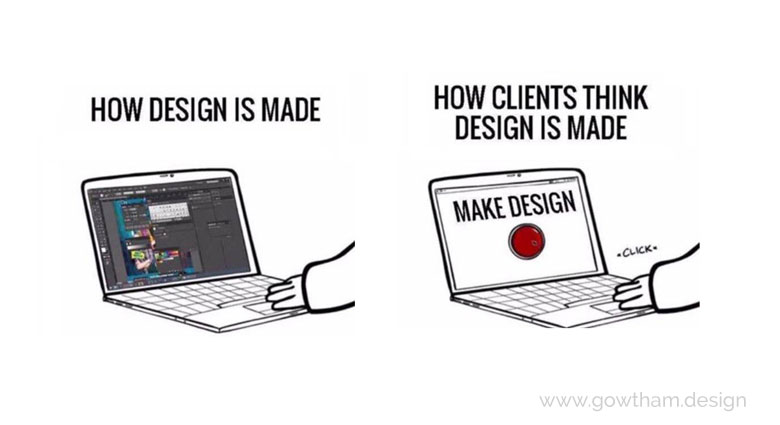

But in general, as long as an interface enables the users to perform intended tasks and delivers intended business value, it's considered *ok* in a developer sense.

While design is not the major focus in this phase, we'll present in the end of this module a convenient classification rule that'll capture a great percentage of distinctions between interfaces. But for now, let's learn the technicals first.

### Task 1: HTML5/CSS3

If you're building a house, most likely you'll first build an outer skeleton of the house, which defines the structure, then you'll tile in the walls, which forms the closure. Then, depending on your needs, you'll coat the bare skeleton of the house with layers of plaster and paint, which will hide the minimum structure and make a pretty interior.

Compare HTML only (left) with HTML with CSS (right).

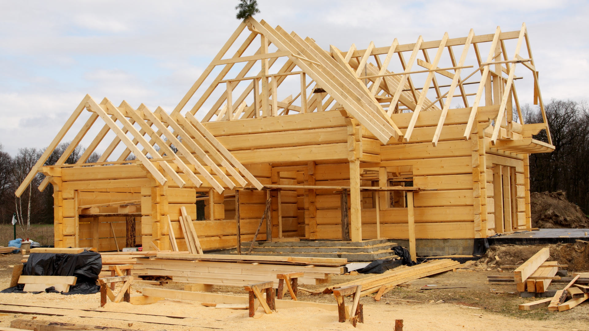

In web development, HTML is the bare building blocks to assemble the skeleton of your house. And CSS is the coating on the skeleton that makes it easy on the eyes. Watch the below two crash courses on HTML and CSS to gain an introductory understanding. You may follow the video to code up some simple interfaces.

[HTML Crash Course](https://www.youtube.com/watch?v=UB1O30fR-EE) and [CSS Crash Course](https://www.youtube.com/watch?v=yfoY53QXEnI)

**Note on the CSS Video**: By the end, the video talks about adaptive UI for web and mobile devices. While traditional thoughts revolve around how to make one interface work with two versions of display, recent development has been more in favor of creating separate versions of UI for different displays.

### Task 2: JavaScript

Continuing our house-building example, what if you'd like a very interesting house feature, such as pushing a button and make the roof open up? These are not static constructs for the house, but *behavioral*. The way web developers set up the behavior of an interface is through the [general purpose programming language](https://en.wikipedia.org/wiki/General-purpose_programming_language) called [JavaScript](https://en.wikipedia.org/wiki/JavaScript).

Examples of House Behavior

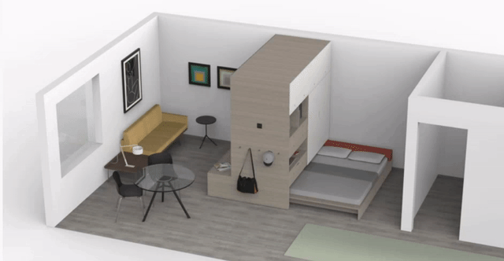

This is the first time we encounter what would be considered a "normal" programming language, and it has many similar features compared to its peers (in terms of having conditionals, syntax for defining functions and loop constructs). Watch the below videos on basic topics for JS. You're also highly encouraged to follow along with the videos to try out the language features.

[JS Tutorial for Beginners](https://www.youtube.com/watch?v=fGdd9qNwQdQ)

[JS Basics: Conditionals](https://www.youtube.com/watch?v=Gy87ZS5sb1w&)

[JS Basics: Functions](https://www.youtube.com/watch?v=AY6X5jZZ_JE)

[JS Basics: Iterations and Arrays](https://www.youtube.com/watch?v=orAS-MBh5f4)

[JS Basics: Selectors](https://www.youtube.com/watch?v=W3EK4MlZW4g)

**Note on Event Handling:** This feature is *unique* to JS and is not shared by its counterparts. Through event handling, JS describes code routines that *respond to* specific occurrences of interface behavior (remember the pushing a button analogy?). Keep the analogy in mind and continue following along the below videos.

[JS Basics: Event Handling 1](https://www.youtube.com/watch?v=e57ReoUn6kM)

[JS Basics: Event Handling 2](https://www.youtube.com/watch?v=0tEW8rB1bbU)

### Task 3: jQuery

No one wants to reinvent the wheel, and probably no one will try to [open a wine bottle with high voltage wire](https://www.youtube.com/watch?v=CC4CWx2U2zA) when a simple corkscrew is available. Consequently, a corkscrew is a *tool* that makes our life easier by performing a specific function.

In similar fashion, JS is sometimes too bare bone and low-level elementary to accomplish complex functionalities easily. Due to this fact, developers made *libraries* of code (which are simple modules of already defined functionalities) to speed up and development process. jQuery is one such library and has been one of the most relevant libraries around. It contains several functions that make describing interface behaviors easier.

Think of jQuery as a tool kit

Watch the below videos for the library and follow along to gain an understanding of its usefulness.

[jQuery: Intro & Selectors](https://www.youtube.com/watch?v=3nrLc_JOF7k)

[jQuery: Event Handling](https://www.youtube.com/watch?v=VlWsJHsVb-E)

[jQuery: DOM Manipulation](https://www.youtube.com/watch?v=q4FWSdX55ls)

[jQuery: Effects & Animations](https://www.youtube.com/watch?v=kVc_XfZY0vI)

**Note on Ajax:** Ajax is one of the *most important* utilities of jQuery. Have you noticed that most of the modern websites (Amazon, Facebook, etc.) these days don't refresh that often during a user session? The interface tends to stay still, present dynamics, but doesn't do *hard refreshes* (which means having the interface disappear -> turn all white -> reappear with things loading). This is accomplished by making background resources calls to the back-end (more on this later).

For now, follow along the video to see how information can be fetched *by code* instead by typing things into your browser's address bar and hit enter.

[jQuery: Ajax](https://www.youtube.com/watch?v=eR3rcalj06Q)

### Task 4: Common Techniques

Over and over again, common difficulties appear throughout a developer's projects. The two most common interface difficulties are how to center/align elements and how to organize a view's perspective smartly.

First, watch a review of the [Two Most Important CSS Attributes](https://vimeo.com/325983692), which will help you understand the next two videos. Then, watch the demo of [Common Centering Techniques](https://vimeo.com/325983906) and [Common Hiding Techniques](https://vimeo.com/325984112).

It's not mandatory, but highly recommended for you to try the examples yourself, as dev proficiency comes from practice. People who're not afraid of writing up code are usually the ones who get better the fastest. You can find the finished .html files from the videos in the 'Task4' folder.

### Demo: Clone an Interface

This module will finish when you complete the project of cloning a industry-level web interface. You may choose any major (or niche) interfaces with *at least one feature* that requires JS/jQuery. In other words, don't choose completely static web pages without any behavioral dynamics whatsoever.

Watch the below demo set to see an example of how to complete this project. The five videos show the process from start to finish of cloning the top section of Amazon's front page (consequently, you're highly discouraged from choosing amazon.com for your own project). Usually, you'll start with a planning phase to analyze the layout of the interface first, then the rest is hard work and struggle.

It's ok to modify and adapt your strategy throughout the process, as it's unpredictable what technical difficulties might appear.

**Step 1: Analyze the Interface**
- [Analysis Tutorial](https://vimeo.com/319119264)

**Step 2: Submit a Proposal**
- [Example Proposal](./Files/[Phase1]_Project_Proposal_Ray_Gao.pdf)

**Step 3: Code Your Project**
- [Actual Coding 1: Top Bar](https://vimeo.com/318277263)
- [Actual Coding 2: Main Content](https://vimeo.com/318280306)
- [Actual Coding 3: Main Content](https://vimeo.com/318285713)
- [Actual Coding 4: Carousal, JS](https://vimeo.com/318291267)

You can find completed code for the demo in the 'DemoClone' folder

### Project: Clone an Interface

Now it's your turn. This project is quite major and can be included in your professional portfolio as a showcase. *Don't forget to submit a proposal first for approval and peer feedback*.

**Optional Project:** Design a Front Page for Yourself

Many artists and professionals have their very own home page. Now that you've learned how to make an interface, why not make a front page of your own to boost your web presence? We'll learn how to actually put your website on the web in the next phase.

### Before We Move On: A Useful Design Spectrum

A useful design rule to capture a *huge* percentage of interface variation (or maybe just everyday design you see) is *Good Deal* vs. *Accentuated*.

- **Good Deal**: Design characterized by presenting a large pack of features and information, with limited white space. This usually creates a stuffed perspective. This fuller and more crowded look conveys the message of "You can get many things here easily at a good value".
- **Accentuated**: Design characterized by presenting a small amount of core features and spotlight information, with a large amount of white space. This usually creates a focused perspective. This cleaner and more breathy look conveys the message of "This *is* the shit you want".

**Example of 'Good Deal' vs. 'Accentuated' design in plating**

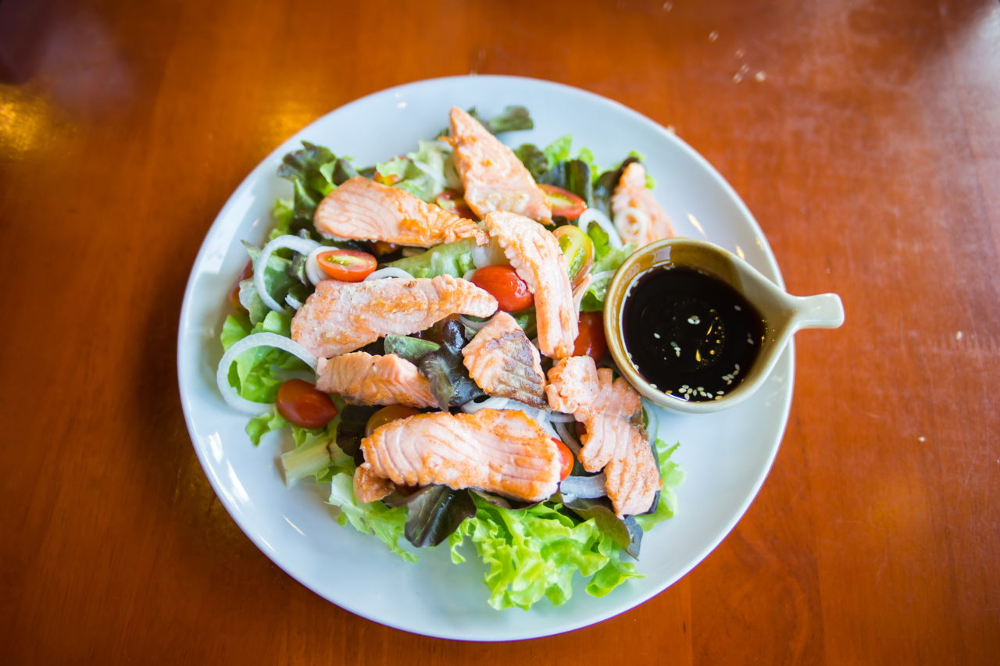

You might ask if 'Good Deal' is more associated with public taste and 'Accentuated' is more associated with exclusivity. The answer is yes, as you'll see in the following examples. But this doesn't mean 'Accentuated' is necessarily better as the end goal of design is always to serve the business purpose.

News websites, for example, are very publicly accessible, therefore usually will have a stuffed interface to capture the taste of a larger demographics. Conversely, 'Accentuated' designs are more targeted toward a specific demographics, and have more room for 'storytelling' (as shown from the plating on the right).

**Examples of 'Good Deal' Websites**

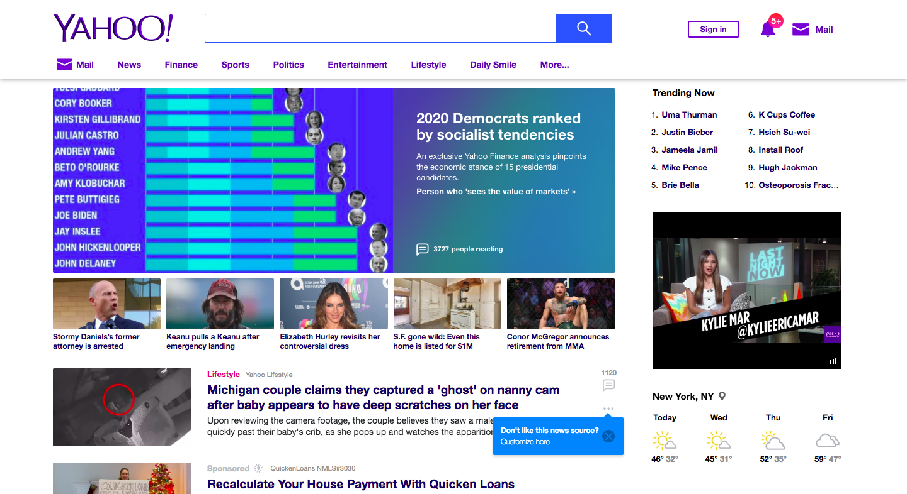

(Yahoo)

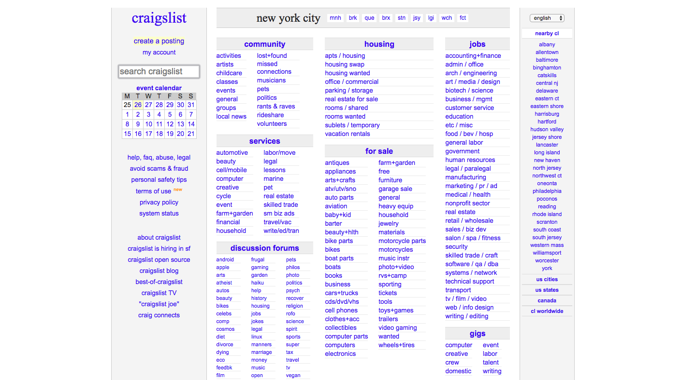

(Craigslist)

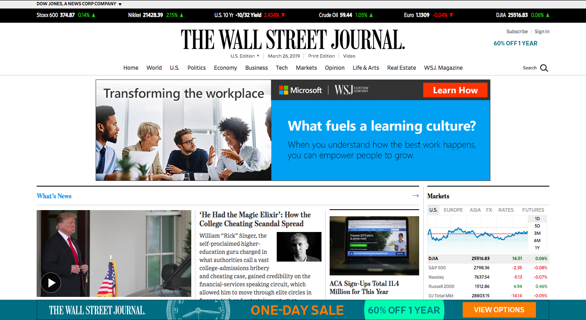

(Wall Street Journal)

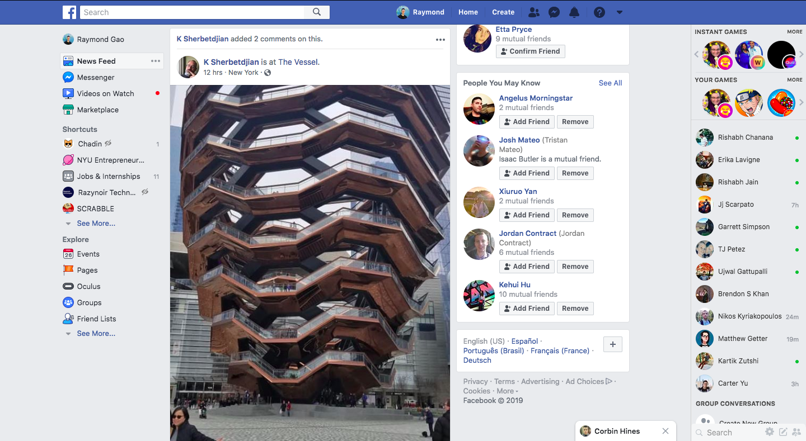

(Facebook)

**Examples of Things in Between**

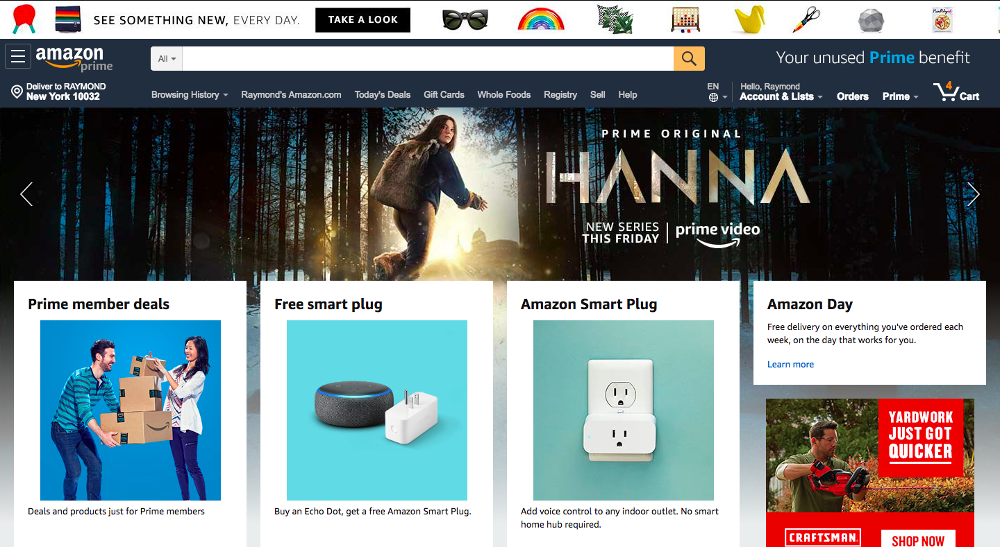

(Amazon)

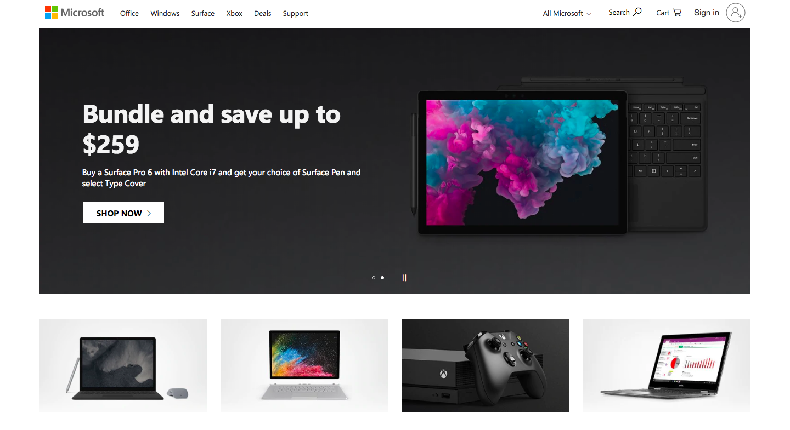

(Microsoft)

**Examples of 'Accentuated' Websites**

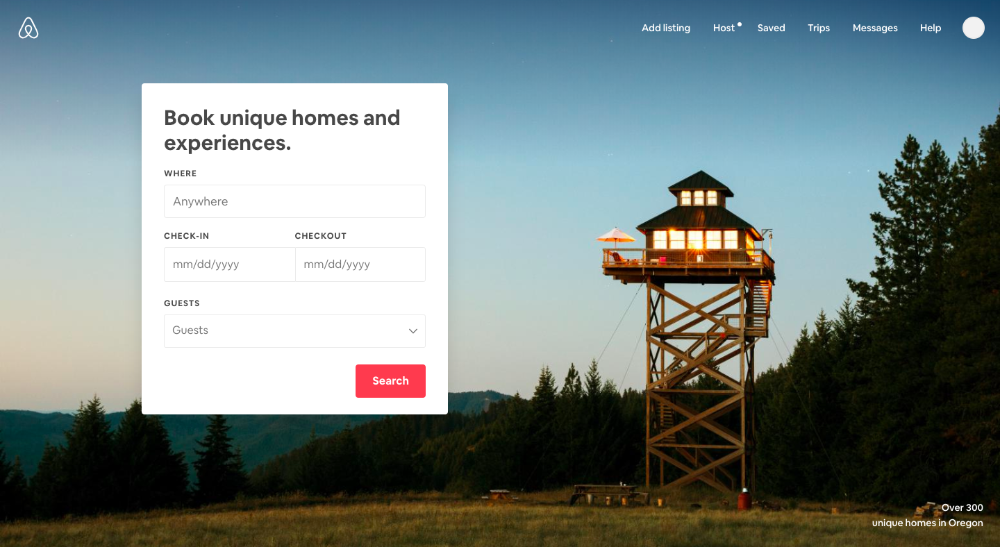

(Airbnb)

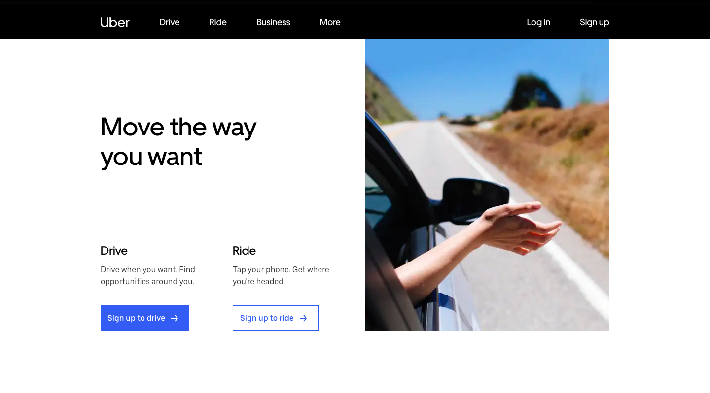

(Uber)

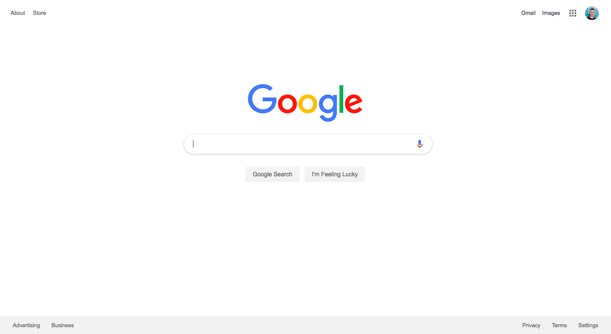

(Google)

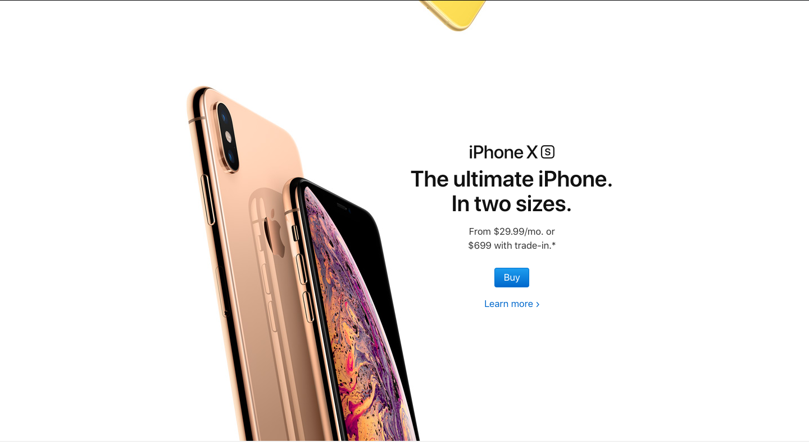

(Apple)

As mentioned, design is not the focus of our current phase, but hopefully this design spectrum can shed some light on the *intention* behind interfaces when you see them. When you're ready, you may move forward to the next phase.

<!-- end of document -->
